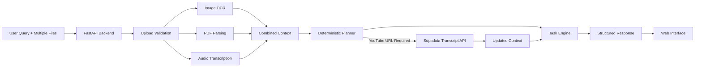

# Multimodal Agent Workbench

> **An agentic multimodal AI application that intelligently orchestrates OCR, document parsing, speech transcription, YouTube transcript retrieval, and LLM-powered reasoning through an explicit planning engine.**


---

# Overview

Multimodal Agent Workbench is a production-inspired AI application that processes heterogeneous inputs—including text, images, PDF documents, audio recordings, and embedded YouTube references—and dynamically constructs the minimum tool sequence required to satisfy a user's request.

Unlike conventional chatbot implementations that rely entirely on unrestricted LLM tool calling, this project uses a deterministic planning layer that makes orchestration transparent, predictable, and testable.

The application is designed around three principles:

- Explicit planning
- Minimal tool execution
- Transparent reasoning

---

# Features

## Supported Input Types

| Input | Processing |
|--------|------------|
| Text | Intent classification & reasoning |
| Images (PNG, JPG) | OCR + Code Analysis |
| PDF Documents | Text Extraction + OCR Fallback |
| Audio (MP3, WAV, M4A) | Speech Transcription |
| Embedded YouTube URLs | Automatic Transcript Retrieval |

---

## AI Capabilities

- Document Summarization
- Code Explanation
- Bug Detection
- Time & Space Complexity Analysis
- Action Item Extraction
- Structured Summaries
- Sentiment Analysis
- Cross-Document Comparison
- Cross-Modal Reasoning
- Conversational Question Answering

---

## Transparent Tool Execution

Every response exposes:

- Execution Trace
- OCR Confidence
- Processing Latency
- Estimated Token Usage
- Estimated Model Cost

This makes every reasoning step observable instead of hidden inside a language model.

---

# Architecture



The planning engine is deterministic.

Instead of allowing an LLM to freely invoke tools, explicit conditions determine:

- whether clarification is required,
- which tools should execute,
- the execution order,
- and when execution should stop.

This makes the orchestration predictable, explainable, and easy to test.

---

# Technology Stack

## Backend

- Python 3.13
- FastAPI
- Uvicorn

## AI Models

- Groq LLM
- Groq Whisper Transcription

## OCR

- Tesseract OCR

## Document Processing

- PyPDF
- Pillow

## External APIs

- Supadata YouTube Transcript API

## Deployment

- Docker
- Render

---

# Repository Structure

```
backend/
│
├── app/
│   ├── services/
│   │   ├── planning.py
│   │   ├── ingestion.py
│   │   ├── text_tasks.py
│   │   ├── youtube.py
│   │   └── agent.py
│   │
│   ├── static/
│   ├── models.py
│   ├── config.py
│   └── main.py
│
tests/
│
Dockerfile
render.yaml
requirements.txt
README.md
```

---

# Supported Workflows

The planning engine dynamically constructs the minimum execution pipeline based on the user's request and the uploaded content.

---

## 📄 Document Summarization

**User Request**

> Summarize this PDF.

**Execution Pipeline**

```text
PDF Upload
    │
    ▼
PDF Parser
    │
    ▼
Text Extraction
    │
    ▼
Structured Summarizer
    │
    ▼
Formatted Summary
```

**Output**

- One-line summary
- Key points
- Five-sentence summary

---

## 🖼️ Code Understanding from Images

**User Request**

> Explain this code.

**Execution Pipeline**

```text
Image Upload
    │
    ▼
OCR Engine
    │
    ▼
Extract Source Code
    │
    ▼
Code Analysis
    │
    ▼
Explanation
    │
    ├── Programming Language
    ├── Bug Detection
    ├── Complexity Analysis
    └── Improvement Suggestions
```

---

## 🎙️ Audio Transcription & Summarization

**User Request**

> Summarize this audio.

**Execution Pipeline**

```text
Audio Upload
    │
    ▼
Speech Transcription
    │
    ▼
Transcript
    │
    ▼
Structured Summarizer
    │
    ▼
Summary Output
```

---

## 🎥 Automatic YouTube Understanding

**User Request**

> Hit the YouTube URL in this PDF and summarize it.

**Execution Pipeline**

```text
PDF Upload
    │
    ▼
PDF Parser
    │
    ▼
Discover YouTube URL
    │
    ▼
Transcript Retrieval
    │
    ▼
Structured Summarizer
    │
    ▼
Video Summary
```

No manual copy-paste of the YouTube URL is required.

---

## 🔄 Cross-Modal Comparison

**User Request**

> Do these files discuss the same topic?

**Execution Pipeline**

```text
Resume.pdf        Interview.mp3
     │                  │
     ▼                  ▼
PDF Parser      Audio Transcriber
     │                  │
     └──────────┬────────┘
                ▼
         Combined Context
                │
                ▼
       Cross-Input Comparator
                │
                ▼
 Similarities • Differences • Uncertainty
```

---

## 💬 Conversational Question Answering

**User Request**

> What is FastAPI?

**Execution Pipeline**

```text
User Query
     │
     ▼
Planner
     │
     ▼
Reasoning Engine
     │
     ▼
Conversational Response
```

No external tools are executed because the planner determines they are unnecessary.

---

## ❓ Clarification Workflow

If the uploaded files do not clearly indicate the intended task, the planner requests clarification before invoking any tool.

```text
Files Uploaded
      │
      ▼
Planner
      │
      ▼
Task Ambiguous?
      │
  Yes ▼
Clarification Gate
      │
      ▼
Wait for User Intent
```

This prevents incorrect assumptions and unnecessary tool execution.

---

# Installation

## Clone Repository

```bash
git clone https://github.com/<your-username>/multimodal-agent-workbench.git

cd multimodal-agent-workbench
```

---

## Create Virtual Environment

```bash
python -m venv .venv
```

Windows

```powershell
.venv\Scripts\Activate.ps1
```

Linux / macOS

```bash
source .venv/bin/activate
```

---

## Install Dependencies

```bash
pip install -r requirements.txt
```

---

## Configure Environment

Copy

```text
.env.example
```

to

```text
.env
```

Add

```
GROQ_API_KEY
SUPADATA_API_KEY
```

---

## Start Development Server

```bash
uvicorn backend.app.main:app --reload
```

Open

```
http://127.0.0.1:8000
```

---

# Environment Variables

| Variable | Purpose |
|------------|---------|
| GROQ_API_KEY | LLM + Audio Transcription |
| SUPADATA_API_KEY | YouTube Transcript Retrieval |
| MODEL_NAME | Language Model |
| TRANSCRIPTION_MODEL | Speech Model |
| MAX_UPLOAD_MB | Upload Size Limit |

---

# REST API

## Health

```
GET /api/health
```

---

## Agent

```
POST /api/run
```

Accepts

- query
- text
- files

Returns

- answer
- extracted content
- execution trace
- token estimate
- confidence
- cost estimate

---

# Running Tests

```bash
python -m pytest -q
```

Current automated tests cover

- Planner Logic
- Clarification Gate
- File Validation
- Task Classification
- OCR Pipeline
- Summarization Contract
- PDF → YouTube Workflow
- Cross-Modal Processing

---

# Deployment

The application is fully containerized.

Deployment is supported through Render using the included

- Dockerfile
- render.yaml

Required environment variables:

```
GROQ_API_KEY
SUPADATA_API_KEY
```

Once deployed, the application exposes

```
/api/health
```

for service monitoring.

---

# Design Principles

## Deterministic Planning

Tool invocation is rule-based rather than model-driven.

---

## Minimal Tool Execution

Only the tools required to satisfy the user's request are executed.

---

## Explainability

Every execution returns an observable tool trace.

---

## Graceful Degradation

Failures in OCR, transcription, or transcript retrieval never discard successfully extracted context.

---

## Robust Input Handling

- File validation
- Upload limits
- Unsupported file detection
- Partial extraction
- Safe error reporting

---

# Example Tool Chains

| User Request | Execution |
|---------------|-----------|
| Explain this code | OCR → Code Reviewer |
| Summarize this PDF | PDF Parser → Summarizer |
| Summarize this Audio | Audio Transcriber → Summarizer |
| Summarize linked YouTube Video | PDF Parser → Transcript → Summarizer |
| Compare Resume and Audio | PDF Parser + Audio Transcriber → Comparator |

---

# Future Enhancements

- Vector Database Integration
- Streaming Responses
- Multi-Agent Collaboration
- Authentication
- Conversation History
- Tool Registry
- Telemetry & Observability
- Distributed Task Execution

---

# License

MIT License

---

# Acknowledgements

This project leverages several excellent open-source technologies, including FastAPI, Groq, Tesseract OCR, PyPDF, Supadata, Docker, and Render.
