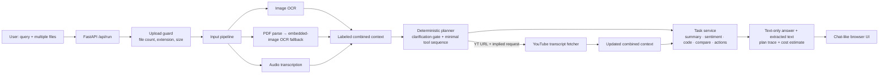

# Multimodal Agent Workbench

A deployed-ready, agentic FastAPI application that accepts text plus multiple files in the same request, extracts their contents, selects an explicit minimum tool sequence, and returns a text-only result with a visible trace.

It was built for the Parallel Minds Gen AI Intern assignment.

## What it supports

| Input | Tool | Graceful degradation |
| --- | --- | --- |
| Text | Intent classifier + final text task | Asks a follow-up if no outcome is stated |
| JPG / PNG | Tesseract OCR | Returns a clear OCR warning and partial result |
| PDF | `pypdf` text extraction, embedded-image OCR fallback | Returns any selectable text plus a scan/OCR warning |
| MP3 / WAV / M4A | Groq transcription; WAV duration is read locally | Keeps duration when available and explains missing API configuration |
| YouTube URL in any extracted input | YouTube Transcript API | Continues with an explicit caption/access warning |

Tasks include cleaned extraction with OCR confidence, strict-format summaries, sentiment, code explanation with bug/complexity notes, action-item extraction, conversational answers, and multi-source topic comparison.

## Architecture



The planner is deliberately deterministic: it makes tool invocation conditions inspectable and testable instead of letting a language model silently choose side effects. The language model is used only for final text analysis and audio transcription when an API key is configured.

## Local setup

Prerequisites: Python 3.12+ and, for image/PDF OCR, the Tesseract binary installed and available on `PATH`.

```bash
python -m venv .venv
# Windows PowerShell
.venv\Scripts\Activate.ps1
pip install -r requirements.txt
Copy-Item .env.example .env
uvicorn backend.app.main:app --reload
```

Open `http://127.0.0.1:8000`.

Set `GROQ_API_KEY` in `.env` for model-assisted answering and MP3/WAV/M4A transcription. Without it, the application remains usable for direct PDF extraction, local OCR, deterministic sentiment, basic summaries, and planning; it tells the user exactly when a model-backed feature cannot run.

## Test suite

```bash
pytest -q
```

The included tests cover the mandatory clarification gate, the PDF → YouTube transcript → summary chain, task classification, summary/sentiment response contracts, and file-type validation.

## Deployment on Render

This repository includes a `Dockerfile` and `render.yaml` blueprint.

1. Create a new public GitHub repository and push this code.
2. In Render, select **New → Blueprint** and connect the repository.
3. Add `GROQ_API_KEY` as a secret environment variable. `MAX_UPLOAD_MB`, `MODEL_NAME`, and `TRANSCRIPTION_MODEL` already have safe defaults in `render.yaml`.
4. Deploy. Render builds the Docker image with Tesseract installed and exposes the app at the generated public HTTPS URL.
5. Paste that URL into the submission under “Live deployment URL”.

The health check is available at `/api/health`.

## Demo checklist

Record a 3–4 minute screen capture covering these four flows:

1. Upload a meeting-notes PDF and ask for action items; open the extracted-text panel and point out the trace.
2. Upload a code-screenshot image and ask “Explain”; show OCR confidence, bug notes, and complexity.
3. Upload an audio file and ask for a summary; show the transcript, duration, and required three summary formats.
4. Upload a PDF containing a YouTube URL and ask to summarize the video; point out `PDF Parser → YouTube Transcript Fetcher → Structured Summarizer` in the trace.

Before recording, use an unlisted/public-captioned YouTube video and a small audio clip. This avoids an avoidable transcript or upload-limit failure during the live demo.

## Design choices

- **Mandatory clarification:** no query means no inferred task. The API returns a concise follow-up question instead of guessing.
- **Bounded tool use:** only supported media types, at most eight files, a configurable size cap, and no arbitrary URL fetcher. A YouTube transcript is fetched only when a supported URL is present and the user’s query implies video content.
- **Partial results:** each input is independently extracted. One broken file does not discard useful context from the others.
- **Prompt-injection containment:** the model system instruction treats extracted content as untrusted reference material, not executable instructions.
- **Cost transparency:** the UI shows a conservative text-generation estimate before billing-sensitive model work is interpreted as a quote. Transcription and external tools are explicitly excluded.

## Submission fields to replace after publishing

- GitHub repository: `https://github.com/<your-username>/<your-repository>`
- Live app: `https://<your-render-service>.onrender.com`
- Demo video: `<your Loom / YouTube-unlisted link>`
